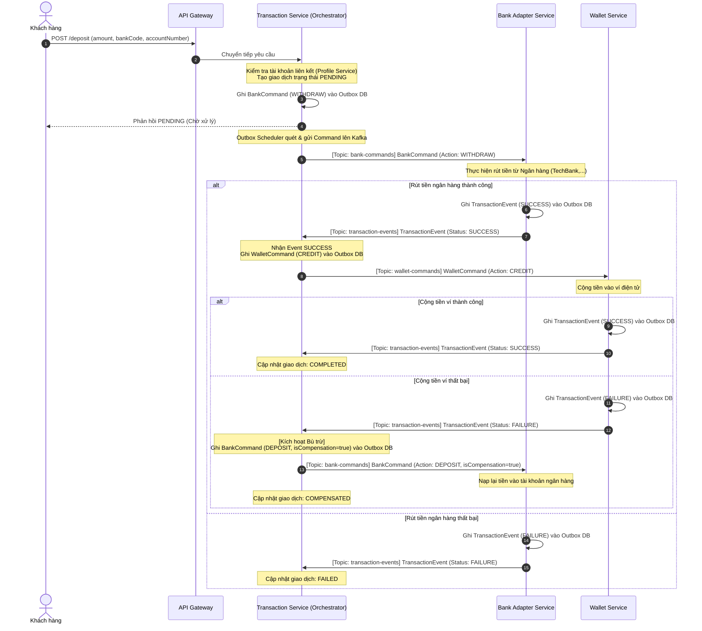
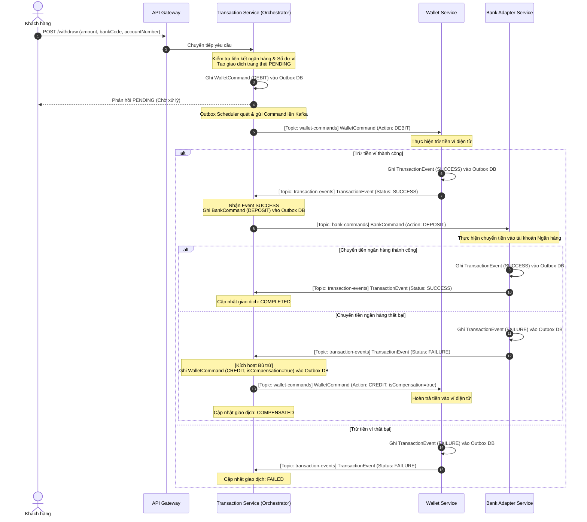
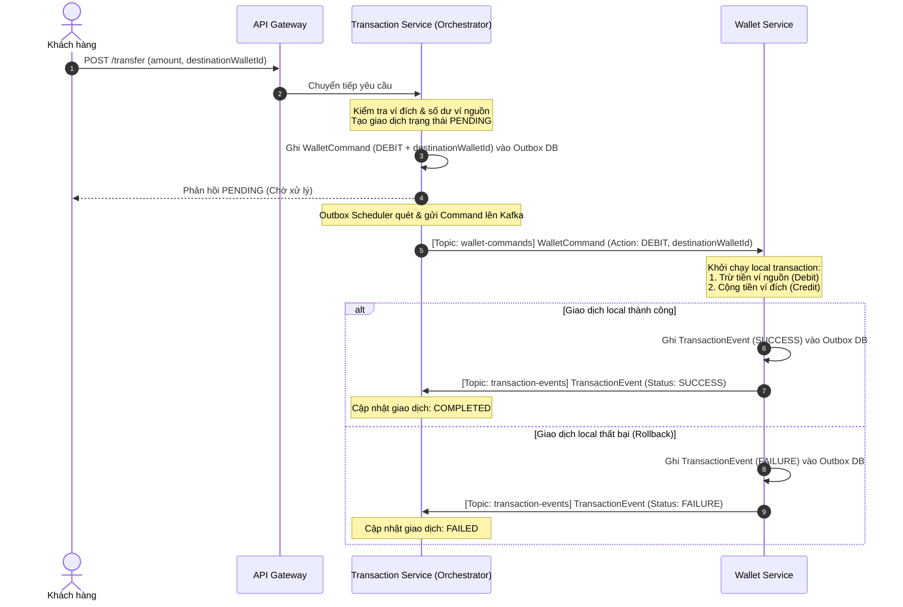

# Hướng Dẫn Luồng Giao Dịch & Kiến Trúc Saga Pattern (E-Wallet Microservices)

Tài liệu này mô tả chi tiết luồng xử lý giao dịch nạp, rút, chuyển tiền, cấu trúc các sự kiện (Events/Commands) phân tán qua Kafka, và cách áp dụng mô hình **Saga Orchestrator** kết hợp với **Transactional Outbox Pattern** trong hệ thống E-Wallet.

---

## 1. Kiến Trúc Tổng Quan (Saga & Transactional Outbox)

Hệ thống áp dụng mô hình **Saga dựa trên điều phối (Orchestrator-based Saga)** để đảm bảo tính nhất quán dữ liệu cuối cùng (Eventual Consistency) giữa các microservices độc lập:

- **Saga Orchestrator**: Được triển khai tại `transaction-service` thông qua lớp [TransactionOrchestrator](file:///home/ndchieu73/Projects/ewallet-microservices/services/transaction-service/src/main/java/com/dinhchieu/ewallet/transaction_service/sagas/orchestrator/TransactionOrchestrator.java). Service này chịu trách nhiệm lưu trạng thái tổng thể của giao dịch và điều phối các bước tiếp theo hoặc kích hoạt giao dịch bù (Compensation).
- **Transactional Outbox Pattern**: Để giải quyết bài toán Dual-Write (ghi vào DB và gửi message tới Kafka đồng thời dễ dẫn đến mất mát/không đồng bộ nếu hệ thống crash), tất cả microservice (`transaction-service`, `wallet-service`, `bank-adapter-service`) đều sử dụng bảng `outbox_message`.
  - **Lưu trữ**: Command/Event được lưu vào DB cùng một Transaction của database.
  - **Scheduler & Processor**: Lớp `OutboxScheduler` quét bảng `outbox_message` mỗi 2 giây, gọi `OutboxProcessor` để gửi dữ liệu dạng Avro sang Kafka và đánh dấu trạng thái là `SENT` nếu thành công.

---

## 2. Quy Trình Các Luồng Giao Dịch

### 2.1 Luồng Nạp Tiền (Deposit): Bank $\rightarrow$ Wallet
*Mục đích: Nạp tiền từ tài khoản ngân hàng đã liên kết vào ví điện tử.*



---

### 2.2 Luồng Rút Tiền (Withdrawal): Wallet $\rightarrow$ Bank
*Mục đích: Rút tiền từ ví điện tử về tài khoản ngân hàng đã liên kết.*



---

### 2.3 Luồng Chuyển Tiền (Transfer): Wallet $\rightarrow$ Wallet
*Mục đích: Chuyển tiền trực tiếp giữa 2 ví điện tử nội bộ.*

Vì cả ví gửi và ví nhận đều nằm trong cùng database của `wallet-service`, luồng này được tối ưu hóa bằng cách thực hiện cả 2 hành động trừ tiền người gửi và cộng tiền người nhận trong **cùng một database transaction local** tại `wallet-service`. Do đó không cần bước bù trừ phức tạp.



---

## 3. Cấu Trúc JSON Của Các Event / Command Trên Kafka

Hệ thống sử dụng Apache Avro để serialize dữ liệu trước khi gửi lên Kafka. Dưới đây là cấu trúc JSON mô tả các trường tương ứng của các schema (được định nghĩa trong file `.avsc`).

### 3.1 BankCommand (Topic: `bank-commands`)
Được gửi từ `transaction-service` tới `bank-adapter-service` để ra lệnh thực hiện giao dịch ngân hàng.

```json
{
  "sagaId": "65e2b86b-a253-4812-bd90-7d63a8a30f30",
  "bankCode": "TCB",
  "action": "WITHDRAW", 
  "amount": 100000.0,
  "accountNumber": "1903456789012",
  "isCompensation": false
}
```
*Chi tiết các trường:*
- `sagaId` (String): UUID định danh phiên Saga giao dịch.
- `bankCode` (String): Mã ngân hàng (ví dụ: `TCB`, `VCB`).
- `action` (Enum): Hành động cần thực hiện (`WITHDRAW` - Rút tiền từ tài khoản bank của user, `DEPOSIT` - Nạp tiền vào tài khoản bank của user).
- `amount` (Double): Số tiền giao dịch.
- `accountNumber` (String): Số tài khoản ngân hàng thực hiện giao dịch.
- `isCompensation` (Boolean): Đánh dấu nếu đây là lệnh chạy bù trừ để sửa lỗi bước trước. Nếu là `true`, `bank-adapter-service` sau khi thực hiện xong sẽ không gửi tiếp event lên topic `transaction-events` nữa để tránh tạo vòng lặp vô hạn.

---

### 3.2 WalletCommand (Topic: `wallet-commands`)
Được gửi từ `transaction-service` tới `wallet-service` để thay đổi số dư ví.

```json
{
  "sagaId": "65e2b86b-a253-4812-bd90-7d63a8a30f30",
  "userId": "d7d11f67-8899-4d6d-88b0-58c0c99df602",
  "action": "CREDIT",
  "amount": 100000.0,
  "transactionType": "DEPOSIT",
  "destinationWalletId": null,
  "isCompensation": false
}
```
*Chi tiết các trường:*
- `sagaId` (String): Định danh Saga.
- `userId` (String): ID của chủ ví thực hiện giao dịch.
- `action` (Enum): Hành động đối với ví (`CREDIT` - Cộng tiền vào ví, `DEBIT` - Trừ tiền khỏi ví).
- `amount` (Double): Số tiền giao dịch.
- `transactionType` (String): Loại giao dịch gốc (`DEPOSIT`, `WITHDRAWAL`, `TRANSFER`).
- `destinationWalletId` (String | null): ID ví nhận tiền (chỉ dùng cho luồng `TRANSFER`, các luồng khác mặc định `null`).
- `isCompensation` (Boolean): Đánh dấu nếu đây là giao dịch bù. Nếu `true`, `wallet-service` sau khi cộng/trừ tiền hoàn tất sẽ không gửi tiếp event lên `transaction-events`.

---

### 3.3 TransactionEvent (Topic: `transaction-events`)
Được gửi từ `wallet-service` hoặc `bank-adapter-service` trả về `transaction-service` (Orchestrator) để thông báo kết quả xử lý command.

```json
{
  "sagaId": "65e2b86b-a253-4812-bd90-7d63a8a30f30",
  "serviceName": "BANK_ADAPTER_SERVICE",
  "status": "SUCCESS",
  "errorCode": null,
  "errorMessage": null,
  "referenceId": "TX-BANK-99210291"
}
```
*Chi tiết các trường:*
- `sagaId` (String): Định danh Saga.
- `serviceName` (String): Tên service phát ra sự kiện (`BANK_ADAPTER_SERVICE` hoặc `WALLET_SERVICE`).
- `status` (String): Trạng thái xử lý (`SUCCESS` hoặc `FAILURE`).
- `errorCode` (Int | null): Mã lỗi nếu xử lý thất bại.
- `errorMessage` (String | null): Tin nhắn lỗi chi tiết nếu thất bại.
- `referenceId` (String | null): Mã tham chiếu giao dịch sinh ra từ phía ngân hàng hoặc database của service phục vụ tra soát.

---

## 4. Cách Saga Áp Dụng Bù Trừ (Compensating Transactions)

Bù trừ là nhân tố cốt lõi trong Saga Pattern để đảm bảo tính nhất quán dữ liệu khi xảy ra lỗi ở các bước giữa chừng:

1. **Nguyên tắc bù trừ**: Hành động bù trừ phải đảo ngược tác dụng của hành động trước đó về mặt nghiệp vụ (ví dụ: Đã rút từ bank $\rightarrow$ bù trừ bằng nạp trả lại bank; Đã trừ tiền ví $\rightarrow$ bù trừ bằng cộng hoàn tiền ví).
2. **Cờ `isCompensation`**: 
   - Khi Orchestrator kích hoạt lệnh bù trừ, nó sẽ set trường `isCompensation = true` trong Command.
   - Khi nhận được command có cờ này, các service xử lý (`wallet-service`, `bank-adapter-service`) hiểu rằng đây là bước cuối cùng để khắc phục sự cố, thực hiện xử lý DB cục bộ và **không gửi thêm bất kỳ TransactionEvent nào nữa** để kết thúc Saga một cách an toàn.
3. **Tính lũy đẳng (Idempotency)**:
   - Trong môi trường phân tán, Kafka có thể gửi trùng lặp message (At-Least-Once). Các service nhận command đều kiểm tra tính trùng lặp qua `sagaId` để tránh việc cộng/trừ tiền 2 lần cho cùng một giao dịch.
